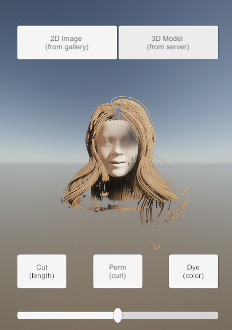
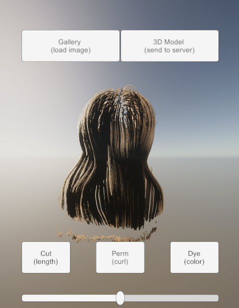

# Unity Client for 내 손안의 헤어샵

## overview

- client-side (application) implementation of 내 손안의 헤어샵
- developed with Unity3D version 2019.4.2f1
- demo screenshot

## UI Component

- Buttons
  - 2D image: access native gallery and load 2D image
  - 3D model: send 2D image to server and get 3D model (.data file)
    - send image via HTTP post
    - get 3D face & hair models as a file
  - Cut / Perm / Dye: modify hairstyle
    - Slider attached to control magnitude

## 3D Object Component

- HairManager: generates **Hair** (saved in prefab) 
  - Hair: models a hair spline with LineRenderer
- FaceManager: anchor for the child component (face)

## Other Assets

- ImageAndVideoPicker: gallery access in Android platform
- HairShader-HDRP: high quality hair shading 

##### TODO

- mtl to mat conversion (mtl file doesn't generate texture in Unity)
- HDRP (high definition render pipeline) for realistic hair rendering
  - try various combinations (e.g. ambient occlusion & specular terms)